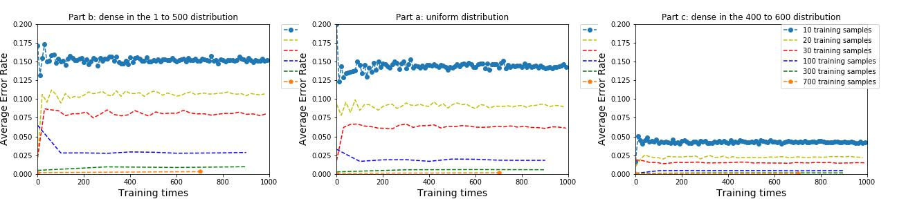

# The-relation-of-error-and-training-sample
Consider a learning problem where the domain is the 1000 consecutive integers {0, 1, 2, 3, . . . , 999}, so each feature vector x is just an interger between 0 and 999. Let the hypothesis class be intervals (each hypothesis maps an interval of these a points to + and everything else to −), so we assume the inductive bias that all the integers in some unknown interval are labeled ”+”, and all integers outside the interval are labeled ”−”. This problem asks you to run some simulations where the target concept maps the integers between 400 and 600 to + and everything else to −.

As shown above, if the distribution of the sample dense (80%) in the range of [400,600], the error of the training show dramatically lower in all the sample size.
